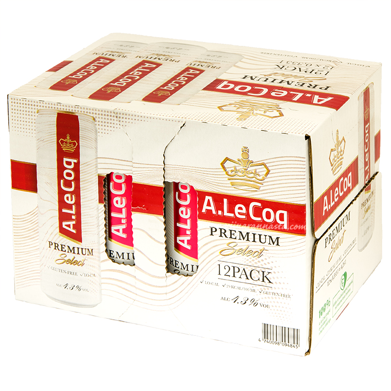
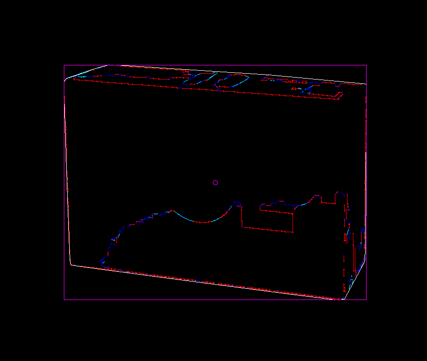
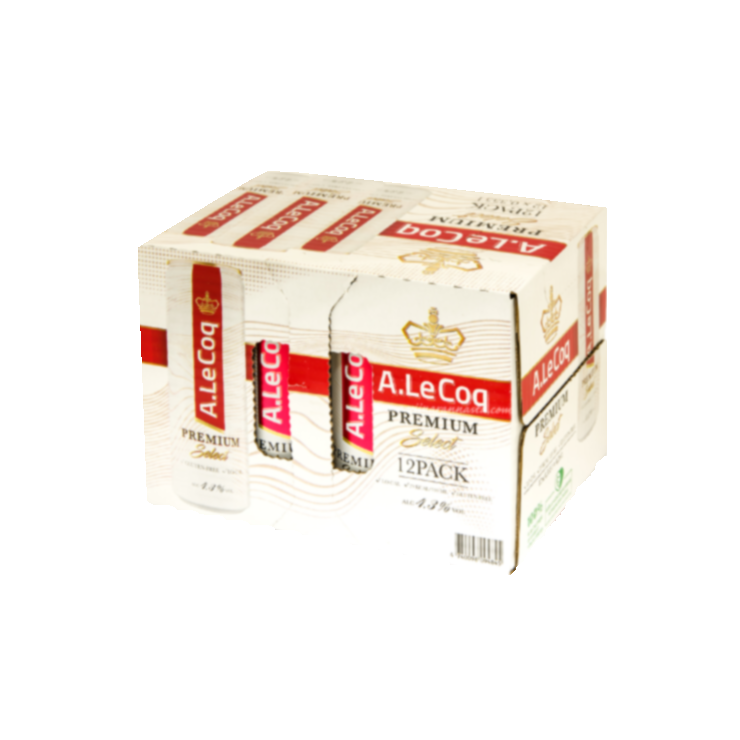

# rannasta-suomeen-opencv
> [!IMPORTANT]
> This is a very specific tool to solve a very specific problem; the FFI-layer and background removal algorithm will very likely not work on other devices / use cases.

Custom C++ based `OpenCV` algorithm used to remove white backgrounds of white products. A FFI-lay enables this algorithm to be run from Rust directly. Performance around 70 images / second *(1000x1000 px)* on a consumer PC. 

## Process

1. Given the input:

> Image provided by Superalko

2. Run an algorithm

> By fine tuning masking details, use a combination of edges to produce upper- and lower-bounds for the final mask
   

3. Use the mask to produce output

> Web friendly 100x100 px icon of the product with the background removed

